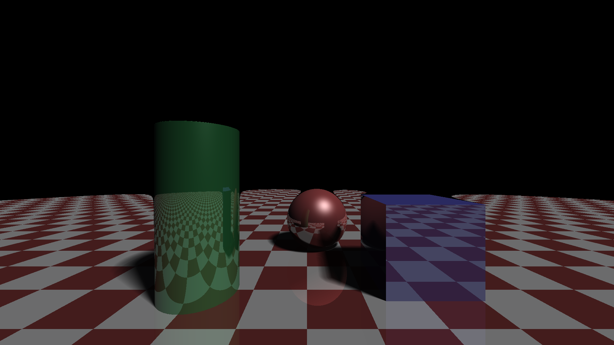

# Raymarcher of 3 Shapes

A lightweight C raymarcher that renders three geometric shapes (cylinder, sphere, and box) with realistic lighting, shadows, and reflections. Perfect for generating artistic wallpapers or learning about raymarching techniques.



## Features

- 🎨 **Three Geometric Primitives**: Cylinder, sphere, and box with distinct colors
- 💡 **Advanced Lighting**: Blinn-Phong specular highlights with soft shadows
- 🪞 **Real-time Reflections**: Objects reflect each other and the checkered floor
- 🌑 **Dark Room Aesthetic**: Moody, dramatic lighting with deep shadows
- 📐 **Signed Distance Functions (SDF)**: Efficient raymarching using mathematical primitives
- 🎯 **Customizable**: Easy to adjust colors, positions, materials, and camera

## Preview

The scene consists of:
- **Green glossy cylinder** (left, forward)
- **Red/brown shiny sphere** (center, behind box)
- **Blue glossy box** (right, forward)
- **Checkered reflective floor** (red and white pattern)

All rendered in a dark room environment with a single light source.

## Requirements

- C compiler (GCC, Clang, or MSVC)
- Standard C library with math.h

### For Converting Output to PNG

One of the following:
- ImageMagick (`convert` or `magick` command)
- Python with PIL/Pillow
- GIMP (GUI)
- FFmpeg

## Installation

1. Clone the repository:
```bash
git clone https://github.com/yourusername/raymarcher-of-3-shape.git
cd raymarcher-of-3-shape
```

2. Compile the code:
```bash
gcc -o raymarcher raymarcher.c -lm
```

Or with optimizations for faster rendering:
```bash
gcc -O3 -o raymarcher raymarcher.c -lm
```

## Usage

### Basic Usage

1. Run the raymarcher:
```bash
./raymarcher
```

2. This generates `out.ppm` in the current directory

3. Convert to PNG:
```bash
convert out.ppm out.png
```
Or:
```bash
magick out.ppm out.png
```

### Output Specifications

- **Resolution**: 1920x1080 (Full HD)
- **Format**: PPM (Portable Pixmap) - easily convertible to PNG/JPG
- **Color Depth**: 24-bit RGB

## Customization

### Adjusting Camera

Find this line in the code:
```c
vec3 ro = {0, 1.2, 5}; // camera position
```

Modify the values `{x, y, z}`:
- **x**: Left/right position (negative = left, positive = right)
- **y**: Height (negative = lower, positive = higher)
- **z**: Distance from scene (lower = closer, higher = farther)

### Adjusting Zoom

Find this line:
```c
float zoom = 1.6; // zoom factor - higher value = wider view
```

- Higher values (e.g., 2.0) = wider field of view
- Lower values (e.g., 1.0) = more zoomed in

### Changing Object Sizes

In the `sceneSDF` function:

**Sphere:**
```c
float sph = sphereSDF(p2, 0.9); // 0.9 is the radius
```

**Cylinder:**
```c
float cyl = cylinderSDF(p1, 0.7, 1.5); // 0.7 = radius, 1.5 = height
```

**Box:**
```c
float box = boxSDF(p3, (vec3){0.85, 0.85, 0.85}); // dimensions
```

### Changing Object Positions

In the `sceneSDF` function, modify the position vectors:

```c
vec3 p1 = sub(p, (vec3){-2.0, 0.5, 1.0});  // Cylinder position
vec3 p2 = sub(p, (vec3){0.3, -0.2, -1.5}); // Sphere position
vec3 p3 = sub(p, (vec3){2.2, -0.2, 0.5});  // Box position
```

### Changing Colors

In the `getColor` function, modify the RGB values:

```c
if (objID == 1) { // Green cylinder
    col = (color){0.2, 0.6, 0.3}; // {R, G, B}
}
```

### Adjusting Lighting

**Ambient light** (base illumination):
```c
float ambient = 0.03; // Lower = darker, higher = brighter
```

**Light direction**:
```c
vec3 lightDir = norm((vec3){0.5, 1, 0.5}); // Direction vector
```

### Image Resolution

Change these defines at the top:
```c
#define WIDTH 1920
#define HEIGHT 1080
```

Common resolutions:
- 1920x1080 (Full HD)
- 2560x1440 (2K)
- 3840x2160 (4K) - warning: very slow!
- 1280x720 (HD)

## Performance Notes

- **1920x1080**: ~30-60 seconds on modern CPU
- **4K resolution**: Several minutes
- Use `-O3` compiler flag for significant speedup
- Reduce `MAX_STEPS` for faster (but less accurate) rendering

## How It Works

This raymarcher uses **Signed Distance Functions (SDFs)** to represent geometry mathematically. Instead of triangles and meshes, shapes are defined by mathematical equations that describe the distance to the nearest surface.

### Key Techniques

1. **Raymarching**: Stepping along rays from the camera until hitting a surface
2. **Soft Shadows**: Multiple samples along shadow rays for realistic penumbra
3. **Reflections**: Secondary rays bounce off surfaces to capture environment
4. **Blinn-Phong Shading**: Specular highlights for glossy materials
5. **Normal Calculation**: Using SDF gradients to determine surface orientation

## Contributing

Contributions are welcome! Feel free to:
- Add new primitive shapes
- Implement new materials or effects
- Optimize rendering performance
- Add animation support
- Create example scenes

## License

MIT License - feel free to use this for any purpose.

## Credits

Created as a learning project for understanding raymarching and signed distance functions.

## Resources

Learn more about raymarching:
- [Inigo Quilez's Articles](https://iquilezles.org/articles/)
- [Shadertoy](https://www.shadertoy.com/) - WebGL raymarching examples
- [Ray Marching and Signed Distance Functions](https://jamie-wong.com/2016/07/15/ray-marching-signed-distance-functions/)

## Troubleshooting

**Compilation errors about math functions:**
- Make sure to link the math library with `-lm` flag

**Output is too dark:**
- Increase `ambient` value in `getColor()` function
- Adjust light direction or add more light sources

**Rendering is very slow:**
- Reduce resolution
- Decrease `MAX_STEPS` constant
- Use `-O3` compiler optimization flag

**Objects look blocky or have artifacts:**
- Increase `MAX_STEPS` for more accuracy
- Decrease `SURF_DIST` for more precise surface detection

## Future Enhancements

- [ ] Add more primitive shapes (torus, cone, etc.)
- [ ] Implement texture mapping
- [ ] Add multiple light sources
- [ ] Support for animation/camera movement
- [ ] Multi-threading for faster rendering
- [ ] Direct PNG output without conversion step
